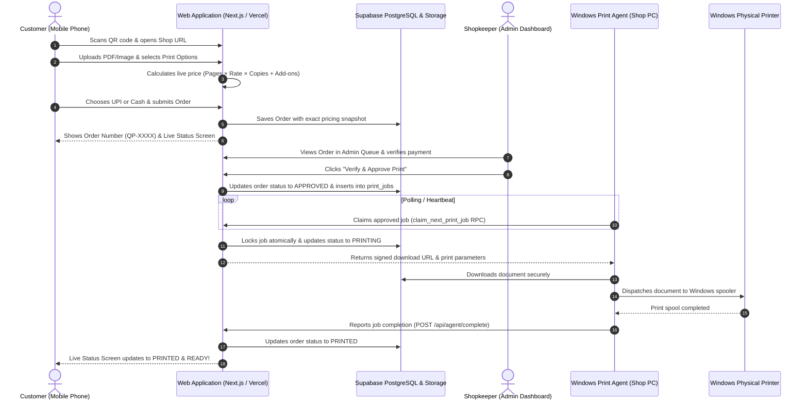
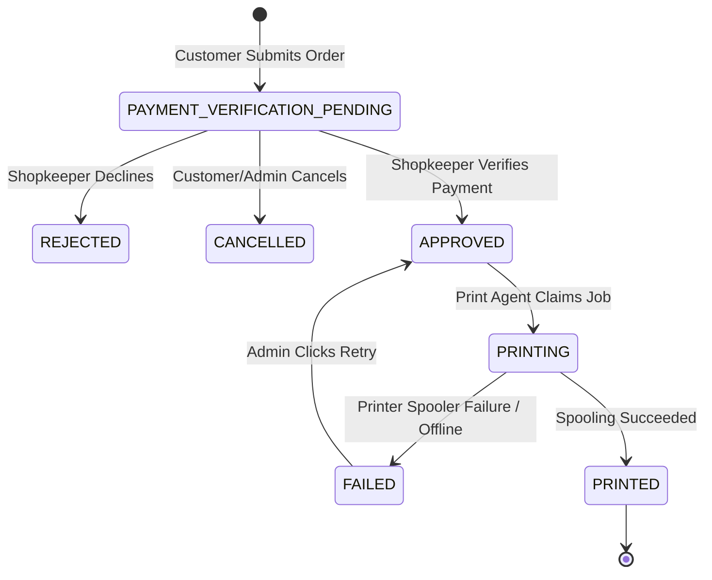

# QuickPrint System Architecture

## End-to-End System Lifecycle

---

## State Transition Diagram

---

## Security Model

1. **Storage Isolation**: Customer documents are stored in private Supabase Storage buckets (`shop-documents`).
2. **Signed URLs**: Temporary signed URLs (expires in 5–60 minutes) are generated only when required by the print agent or admin preview.
3. **Agent Authentication**: Print agent calls are authorized via secret token (`PRINT_AGENT_SECRET`), preventing unauthorized job access or spoofing.
4. **Idempotency**: Atomic PostgreSQL row locks (`FOR UPDATE SKIP LOCKED` inside `claim_next_print_job`) guarantee no job is ever printed twice even during network hiccups or agent restarts.
